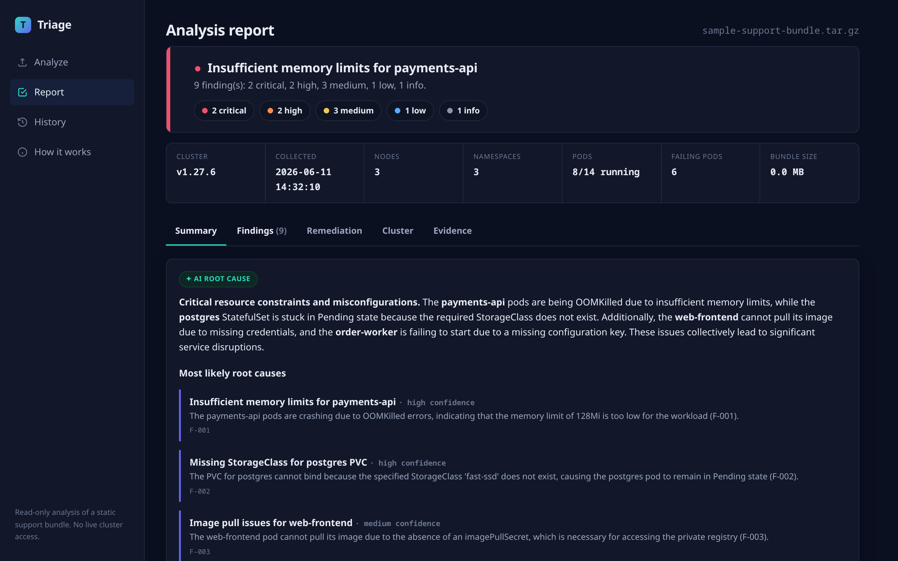

# Triage

**AI triage for [Troubleshoot](https://troubleshoot.sh) support bundles.**

When a Kubernetes app breaks inside a customer's disconnected environment, the vendor never gets to touch the cluster — they get a `.tar.gz` support bundle and have to reason about a system they can't see. That analysis is slow, needs real K8s expertise, and means correlating logs, events, and resource state by hand.

Triage does the first pass for you. Drop in a support bundle and it parses the archive, runs a catalog of deterministic failure detectors, then uses an LLM to correlate the findings into a root-cause narrative and a prioritized fix plan — with every claim linked back to the evidence it came from.

> **Live demo:** _(URL added after deploy — see `BUILD_LOG.md`)_



## How it works

Triage deliberately keeps the AI away from the raw archive. Bundles are big and noisy, and feeding megabytes of logs to a model is how you get confident-sounding fiction. Instead:

1. **Parse.** The bundle is extracted and walked. Rather than hard-coding paths, the parser reads every `cluster-resources` JSON file and buckets objects by their Kubernetes `kind`, so it tolerates layout differences between Troubleshoot versions. Pod logs, events, and node state are indexed alongside.
2. **Detect.** A set of pure-function detectors runs over the parsed model — workloads (OOMKilled, CrashLoopBackOff, ImagePullBackOff), storage (unbound PVCs / missing StorageClass), config (missing ConfigMap keys), nodes (NotReady, resource pressure), warning-event aggregation, and a log-pattern scanner. Each finding carries a severity, the affected resources, and an **evidence excerpt with its source path**.
3. **Reason.** The findings — not the raw logs — are distilled into a compact digest and sent to an LLM acting as a senior support engineer. It names the most likely root cause, correlates symptoms into causal chains, and writes a remediation plan. **No API key? The detectors still produce a full report**; only the narrative layer falls back to a deterministic summary.

The result: deterministic precision you can trust, plus the correlation and prose an LLM is actually good at.

## Run it

Requires Node 20+ and `tar` on the PATH.

```bash
git clone https://github.com/<you>/triage.git
cd triage
npm install

# (optional) enable the AI reasoning layer
cp .env.example .env        # then put your OpenAI key in .env

npm run dev                 # http://localhost:3000
```

Open the app, drag in a `support-bundle.tar.gz`, or click **Analyze sample bundle** to run against the bundled `acme-shop` example (which has planted failures). There's also a **healthy bundle** button to see a clean result for contrast.

### Command line

Same engine, no browser:

```bash
npm run analyze -- samples/sample-support-bundle.tar.gz
npm run analyze -- path/to/your-bundle.tar.gz --json   # machine-readable
```

### The sample bundles

`samples/` ships two generated bundles. Regenerate them anytime:

```bash
npm run gen:sample
```

The broken one plants a deliberate cascade — a missing `fast-ssd` StorageClass strands Postgres in `Pending`, so the rest of the app logs `connection refused` — plus independent OOM, image-pull, config, and node failures. It's the best way to see the root-cause correlation work. The generator (`scripts/generate-sample-bundle.mjs`) is readable if you want to see how a Troubleshoot bundle is laid out.

## Configuration

| Variable | Default | Purpose |
|---|---|---|
| `OPENAI_API_KEY` | _(unset)_ | Enables the LLM reasoning layer. Without it, Triage runs detectors only. |
| `OPENAI_MODEL` | `gpt-4o-mini` | Model used for the reasoning call. |
| `PORT` | `3000` | HTTP port. |
| `DATA_DIR` | `./data` | Where analyses are persisted. |

The key is read **server-side only** — it never reaches the browser, and `.env` is git-ignored. If you deployed this, rotate the key when you're done evaluating.

## Architecture

```
src/
  bundle/extract.ts   untar to a temp dir (system tar)
  bundle/parse.ts     walk the tree → kind-bucketed model (layout-tolerant)
  detectors/          one module per signal class; each returns evidence-backed findings
  ai.ts               digest builder + OpenAI call + deterministic fallback
  analyze.ts          pipeline: parse → detect → verdict → reason
  store.ts            JSON-file persistence (no native deps)
  server.ts           Express API + static frontend
  cli.ts              terminal report
public/index.html     single-file frontend (extended from ui/mockup.html)
```

The detectors are the heart of it — each is a small, testable pure function over the parsed bundle, so adding a new check is a self-contained PR. See `test/` for the end-to-end run over the sample bundle.

## Tests

```bash
npm test
```

The suite runs the full pipeline against the synthesized bundle and asserts that each planted failure is detected and correctly classified.

## Deploying

Containerized via the included `Dockerfile`; `railway.json` points Railway at it. Set `OPENAI_API_KEY` as a deploy secret (not in code). History persistence is ephemeral without a mounted volume, which is fine for a demo — the sample is always re-analyzable.

## License

MIT — see [LICENSE](LICENSE).
